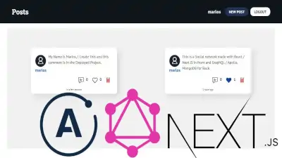
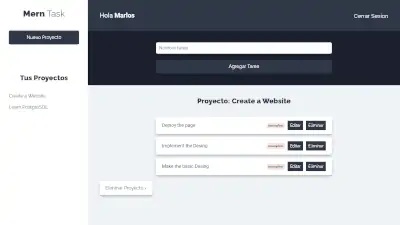

# Marlos Rodríguez

# Projects

    <a href="https://github.com/Marlos-Rodriguez/MERN-GraphQL-Comment-Back" target="blank">
         &nbsp; &nbsp;
    </a>
    <a href="https://github.com/Marlos-Rodriguez/Go-Microservice-Virtual-Wallet" target="blank">
         &nbsp; &nbsp;
    </a>

   <a href="https://github.com/Marlos-Rodriguez/Twitter-Clon-Back" target="blank">
         &nbsp; &nbsp;
    </a>
   <a href="https://github.com/Marlos-Rodriguez/MERN-Task-Servidor" target="blank">
         &nbsp; &nbsp;
    </a>

## Contact

    <a href="https://www.linkedin.com/in/marlos-rodriguez/" target="blank">
         &nbsp; &nbsp;
    </a>
    <a href="https://twitter.com/RodriguezMarlos" target="blank">
         &nbsp; &nbsp;
    </a>

